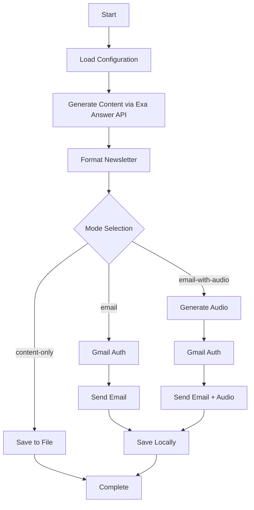

# AI Newsletter Generator Suite

🎙️ **Automated AI-powered newsletter generation with multiple delivery options**

Two powerful newsletter generators for different use cases:

## 📚 Available Tools

### 1. **AI Voice Newsletter** (`ai_news.py`)
Full-featured newsletter with Gmail delivery and voice synthesis
- 🎵 Audio synthesis with ElevenLabs
- 📧 Email delivery via Gmail OAuth
- 🔍 Content generation with Exa Answer API
- 🎙️ Smart audio summaries (3-minute broadcast style)

### 2. **AI Websets Newsletter** (`ai_news_websets.py`) ⭐ NEW
Streamlined newsletter generation using Exa Websets for curated content
- 🔍 Exa Websets API for intelligent content curation
- 🧠 Smart enrichments with summaries and impact analysis
- 📊 Professional formatting with source transparency
- 💾 Local file output (no email/audio complexity)

**👉 [See Websets README](README_websets.md) for detailed documentation**

---

## AI Voice Newsletter (`ai_news.py`)

An intelligent newsletter generator that creates comprehensive AI & Technology newsletters using the latest news sources, converts summaries to audio, and delivers content via Gmail with OAuth 2.0 authentication.

## ✨ Features

### 🔍 **Content Generation**
- **Exa Answer API Integration**: Generates comprehensive newsletters with AI-powered content synthesis
- **Multi-source Research**: Pulls from TechCrunch, Ars Technica, The Verge, Wired, VentureBeat, and more
- **Recent News Focus**: Configurable date range (last 3 days by default)
- **Structured Content**: Organized sections for company announcements, product launches, funding rounds, research breakthroughs, and industry trends

### 🎵 **Audio Synthesis**
- **ElevenLabs Integration**: Converts newsletter summaries to high-quality speech
- **Smart Audio Optimization**: Creates 3-minute professional broadcast scripts (~480 words)
- **Content Consistency**: Audio summaries match newsletter content exactly
- **Voice Customization**: Configurable voice ID and synthesis settings
- **Audio Attachments**: Automatically attaches audio files to emails

### 📧 **Gmail Integration**
- **OAuth 2.0 Authentication**: Secure Gmail API access with credentials.json
- **Direct Email Delivery**: Send newsletters directly through Gmail
- **Multiple Recipients**: Support for multiple email addresses
- **Audio Attachments**: MP3 files attached to emails
- **HTML + Text**: Optimized email formatting for better deliverability

### 🛠️ **Operational Modes**
- **Content Only**: Generate and save newsletter content to file
- **Email Only**: Generate and send newsletter via email (no audio)
- **Email + Audio**: Complete workflow with audio summary attachment (default)
- **Reset Auth**: Clear Gmail authentication tokens

### 📊 **Content Management**
- **Content Consistency**: Audio summaries based on actual newsletter content
- **Local Backup**: Saves all versions (newsletter, HTML, audio scripts)
- **Multiple Formats**: Text, HTML, and audio file outputs
- **Detailed Logging**: Comprehensive status reporting and error handling
- **Performance Tracking**: Real-time timing and word count metrics

## 🚀 Quick Start

### 1. **Clone & Setup**
```bash
cd "Exa-projects/Exa + Composio + Elevenlabs"
pip install python-dotenv requests google-api-python-client google-auth-oauthlib google-auth-httplib2
```

### 2. **Environment Configuration**
Create a `.env` file:
```env
# Required
EXA_API_KEY=your_exa_api_key
ELEVENLABS_API_KEY=your_elevenlabs_api_key
RECIPIENT_EMAILS=email1@example.com,email2@example.com

# Optional
NEWSLETTER_TOPIC=AI and Technology
ELEVENLABS_VOICE_ID=pNInz6obpgDQGcFmaJgB
SENDER_EMAIL=newsletter@yourcompany.com
MAX_ARTICLES=8
```

### 3. **Setup Gmail API**

#### **Step 1: Google Cloud Console Setup**
1. Go to [Google Cloud Console](https://console.cloud.google.com/)
2. Create a new project or select existing
3. Enable Gmail API
4. Go to APIs & Services → Credentials
5. Click 'Create Credentials' → 'OAuth client ID'
6. Choose 'Desktop application'
7. Under 'Authorized redirect URIs', add: `http://localhost:8080/`
8. Download `credentials.json` to this directory

#### **Step 2: First Authentication**
```bash
# Reset any existing tokens
python ai_news.py --reset-auth

# Authenticate (will open browser)
python ai_news.py --email-with-audio
```

### 4. **Run Newsletter Generator**
```bash
# Generate content only
python ai_news.py --content-only

# Send email without audio
python ai_news.py --email

# Full workflow with audio (default)
python ai_news.py --email-with-audio
# or simply
python ai_news.py
```

## 📋 Usage Examples

### **Basic Newsletter Generation**
```bash
python ai_news.py
```
- Generates comprehensive newsletter
- Creates 3-minute audio summary
- Sends email with audio attachment
- Saves all files locally

### **Content Preview Mode**
```bash
python ai_news.py --content-only
```
- Generates newsletter content with summary
- Saves to `newsletter_content_TIMESTAMP.txt`
- No email sending or audio generation

### **Email Without Audio**
```bash
python ai_news.py --email
```
- Generates and sends newsletter via email
- No audio generation
- Faster execution time

### **Reset Authentication**
```bash
python ai_news.py --reset-auth
```
- Clears stored Gmail tokens
- Forces new OAuth flow on next run

## ⚙️ Configuration Options

### **Environment Variables**

| Variable | Required | Description | Default |
|----------|----------|-------------|---------|
| `EXA_API_KEY` | ✅ | Exa AI API key for content generation | - |
| `ELEVENLABS_API_KEY` | ✅* | ElevenLabs API key for audio synthesis | - |
| `RECIPIENT_EMAILS` | ✅* | Comma-separated email addresses | - |
| `NEWSLETTER_TOPIC` | ❌ | Newsletter topic/focus area | "AI and Technology" |
| `ELEVENLABS_VOICE_ID` | ❌ | ElevenLabs voice ID for audio | "pNInz6obpgDQGcFmaJgB" |
| `SENDER_EMAIL` | ❌ | Sender email address | "newsletter@yourcompany.com" |
| `MAX_ARTICLES` | ❌ | Maximum articles to include | 8 |

*Required for specific modes only

### **Command Line Options**

```bash
python ai_news.py [OPTIONS]

Options:
  --content-only      Generate content and save to file only
  --email            Generate and send newsletter via email (no audio)
  --email-with-audio Generate newsletter with audio and send via email (default)
  --reset-auth       Reset Gmail authentication (delete saved tokens)
  -h, --help         Show help message
```

### **Audio Optimization**

The system creates broadcast-quality audio summaries:

- **Target Length**: 3 minutes (~480 words)
- **Content Source**: Based on actual newsletter content for consistency
- **Speech Optimization**: Removes time references, asterisks, URLs
- **Professional Format**: News broadcast style with intro and closing
- **Fallback Layers**: Multiple fallback methods if primary generation fails

## 📁 Output Files

### **Standard Output**
- `newsletter_backup_TIMESTAMP.txt` - Content sent via email
- `newsletter_TIMESTAMP.html` - HTML formatted version
- `newsletter_audio/newsletter_summary_TIMESTAMP.mp3` - Audio summary
- `audio_script_TIMESTAMP.txt` - Audio script for reference

### **Content-Only Mode**
- `newsletter_content_TIMESTAMP.txt` - Newsletter content with summary

## 🔧 Troubleshooting

### **Gmail Authentication Issues**

#### **"redirect_uri_mismatch" Error**
```bash
# Quick Fix:
1. Go to: https://console.cloud.google.com/apis/credentials
2. Find your OAuth 2.0 Client ID and click Edit
3. Under 'Authorized redirect URIs', add: http://localhost:8080/
4. Click 'SAVE'
5. Run: python ai_news.py --reset-auth
6. Run: python ai_news.py --email-with-audio
```

#### **"deleted_client" Error**
- OAuth client was deleted/disabled in Google Cloud Console
- Create new OAuth credentials and download new `credentials.json`

#### **Port Issues**
- Script automatically tries ports 8080, 8081, 8082, 8083
- Ensure at least one port is available
- Add `http://localhost:8080/` to OAuth redirect URIs

### **Content Generation Issues**

#### **Exa API Errors**
- Verify API key is correct and active
- Check API quota/limits
- Ensure internet connectivity

#### **Short/Poor Content**
- Adjust `NEWSLETTER_TOPIC` to be more specific
- Check if fallback content is being used
- Verify recent news sources are available

### **Audio Generation Issues**

#### **ElevenLabs Errors**
- Verify API key and quota
- Check voice ID exists: `pNInz6obpgDQGcFmaJgB`
- Ensure audio directory is writable

#### **Audio Not Generated**
- Check if `ELEVENLABS_API_KEY` is set
- Audio skipped in `--content-only` and `--email` modes
- Only generated in `--email-with-audio` mode

## 🏗️ Project Structure

```
Exa + Composio + Elevenlabs/
├── ai_news.py              # Main application
├── README.md               # This file
├── .env                    # Environment configuration (create this)
├── credentials.json        # Gmail OAuth credentials (download from Google)
├── token.json             # Stored Gmail auth tokens (auto-generated)
├── newsletter_audio/       # Generated audio files
├── newsletter_backup_*.txt # Email content backups
├── newsletter_*.html       # HTML versions
├── audio_script_*.txt     # Audio transcripts
└── newsletter_content_*.txt # Content-only outputs
```

## 🔄 Workflow Overview



## 🎯 Performance

- **Target Time**: 3 minutes total execution
- **Typical Performance**:
  - Content Generation: 30-60 seconds
  - Audio Synthesis: 10-20 seconds
  - Gmail Authentication: 5-10 seconds (first time)
  - Email Delivery: 5-15 seconds

## 🔗 API Documentation

- **Exa Answer API**: [docs.exa.ai/reference/answer](https://docs.exa.ai/reference/answer)
- **ElevenLabs API**: [elevenlabs.io/docs](https://elevenlabs.io/docs)
- **Gmail API**: [developers.google.com/gmail/api](https://developers.google.com/gmail/api)
- **Google OAuth 2.0**: [developers.google.com/identity/protocols/oauth2](https://developers.google.com/identity/protocols/oauth2)

## 🆘 Support

### **Common Solutions**
1. **"No content generated"** → Check Exa API key and internet connection
2. **"Gmail auth failed"** → Run `--reset-auth` and check credentials.json
3. **"Audio failed"** → Check ElevenLabs API key and quota
4. **"redirect_uri_mismatch"** → Add `http://localhost:8080/` to OAuth client

### **Debug Mode**
Run with verbose output to see detailed execution:
```bash
python ai_news.py --email-with-audio 2>&1 | tee debug.log
```

### **Authentication Reset**
If you encounter persistent authentication issues:
```bash
# Clear all auth data
python ai_news.py --reset-auth

# Remove credentials and start fresh
rm credentials.json token.json

# Download new credentials.json from Google Cloud Console
# Run authentication flow again
python ai_news.py --email-with-audio
```

---

## 🤔 Which Tool Should I Use?

### Choose **AI Voice Newsletter** (`ai_news.py`) if:
- ✅ You want email delivery to subscribers
- ✅ You need audio versions for accessibility/convenience
- ✅ You want a complete automated workflow
- ✅ You're comfortable with Gmail OAuth setup
- ✅ You want 3-minute broadcast-style audio summaries

### Choose **AI Websets Newsletter** (`ai_news_websets.py`) if:
- ✅ You want the highest quality, curated content
- ✅ You prefer to handle distribution yourself
- ✅ You want detailed article analysis and enrichments
- ✅ You only want to setup one API key (Exa)
- ✅ You want to see the webset creation process transparently
- ✅ You're building a content pipeline or need structured data

### Quick Comparison

| Feature | Voice Newsletter | Websets Newsletter |
|---------|------------------|-------------------|
| **Content Quality** | Good (Answer API) | Excellent (Curated + Enriched) |
| **Setup Complexity** | Medium (Gmail OAuth) | Low (1 API key) |
| **Email Delivery** | ✅ Automated | ❌ Manual |
| **Audio Generation** | ✅ Yes (3-min broadcasts) | ❌ No |
| **Content Enrichments** | ❌ Basic | ✅ Advanced (summaries, impact analysis) |
| **Source Transparency** | ❌ Limited | ✅ Full webset visibility |
| **Output Format** | Text + Audio + Email | Text + JSON |
| **Authentication** | Gmail OAuth | None required |
| **Best For** | Automated distribution | Content analysis & curation |

---

**Built with ❤️ using Exa AI, Gmail API, and ElevenLabs** 