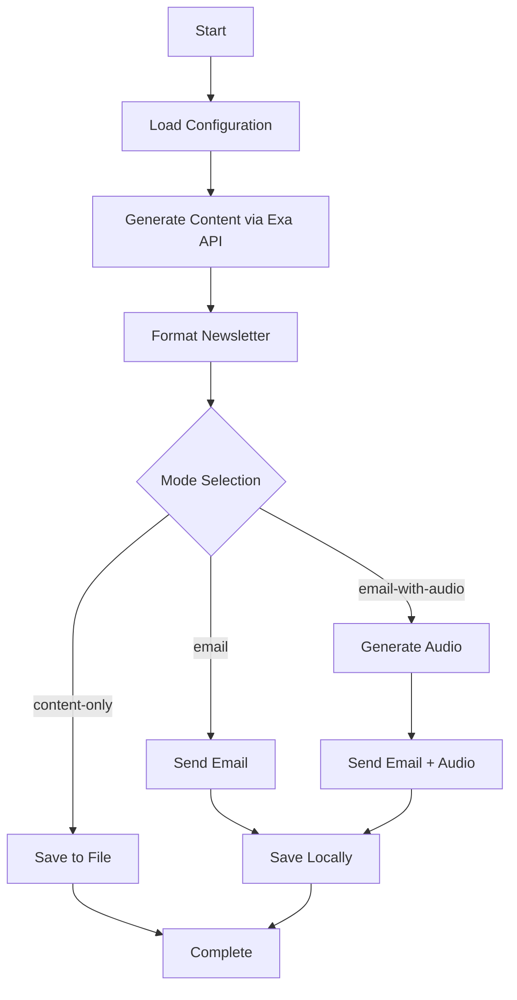

# AI Newsletter Generator Suite

🎙️ **Automated AI-powered newsletter generation with multiple delivery options**

Two powerful newsletter generators for different use cases:

## 📚 Available Tools

### 1. **AI Voice Newsletter** (`ai_news.py`)
Full-featured newsletter with email delivery and voice synthesis
- 🎵 Audio synthesis with ElevenLabs
- 📧 Email delivery via Composio/Gmail
- 🔍 Content generation with Exa Answer API

### 2. **AI Websets Newsletter** (`ai_news_websets.py`) ⭐ NEW
Streamlined newsletter generation using Exa Websets for curated content
- 🔍 Exa Websets API for intelligent content curation
- 🧠 Smart enrichments with summaries and impact analysis
- 📊 Professional formatting with source transparency
- 💾 Local file output (no email/audio complexity)

**👉 [See Websets README](README_websets.md) for detailed documentation**

---

## AI Voice Newsletter (`ai_news.py`)

An intelligent newsletter generator that creates comprehensive AI & Technology newsletters using the latest news sources, converts summaries to audio, and delivers content via email with smart character limit handling.

## ✨ Features

### 🔍 **Content Generation**
- **Exa Answer API Integration**: Generates comprehensive newsletters with AI-powered content synthesis
- **Multi-source Research**: Pulls from TechCrunch, Ars Technica, The Verge, Wired, VentureBeat, and more
- **Recent News Focus**: Configurable date range (last 3 days by default)
- **Structured Content**: Organized sections for company announcements, product launches, funding rounds, research breakthroughs, and industry trends

### 🎵 **Audio Synthesis**
- **ElevenLabs Integration**: Converts newsletter summaries to high-quality speech
- **Smart Audio Optimization**: Automatically truncates to ~200 words for optimal listening length
- **Voice Customization**: Configurable voice ID and synthesis settings
- **Audio Attachments**: Automatically attaches audio files to emails

### 📧 **Email Delivery**
- **Dual Delivery Methods**: Composio (primary) + Gmail SMTP (fallback)
- **Character Limit Handling**: Smart truncation with preservation of full content
- **Multiple Recipients**: Support for multiple email addresses
- **Plain Text + HTML**: Optimized email formatting for better deliverability

### 🛠️ **Operational Modes**
- **Content Only**: Generate and save newsletter content to file
- **Email Only**: Generate and send newsletter via email (no audio)
- **Email + Audio**: Complete workflow with audio summary attachment (default)

### 📊 **Content Management**
- **Smart Truncation**: Preserves content integrity while respecting email limits
- **Local Backup**: Saves all versions (sent content, full content, truncation summaries)
- **Multiple Formats**: Text, HTML, and audio file outputs
- **Detailed Logging**: Comprehensive status reporting and error handling

## 🚀 Quick Start

### 1. **Clone & Setup**
```bash
cd "Exa-projects/Exa + Composio + Elevenlabs"
pip install python-dotenv openai composio-openai requests
```

### 2. **Environment Configuration**
Create a `.env` file:
```env
# Required
EXA_API_KEY=your_exa_api_key
ELEVENLABS_API_KEY=your_elevenlabs_api_key
RECIPIENT_EMAILS=email1@example.com,email2@example.com

# Email Delivery (Choose ONE option)
# Option A - Composio (Recommended)
OPENAI_API_KEY=your_openai_key
COMPOSIO_API_KEY=your_composio_key

# Option B - Gmail SMTP (Fallback)
GMAIL_USER=your-email@gmail.com
GMAIL_APP_PASSWORD=your-app-password

# Optional
NEWSLETTER_TOPIC=AI and Technology
ELEVENLABS_VOICE_ID=pNInz6obpgDQGcFmaJgB
MAX_ARTICLES=8
```

### 3. **Setup Email Delivery**

#### **Option A: Composio (Recommended)**
```bash
composio login
composio add gmail
```

#### **Option B: Gmail SMTP**
1. Enable 2-Factor Authentication on your Gmail account
2. Generate an App Password: [Google App Passwords](https://support.google.com/accounts/answer/185833)
3. Add credentials to `.env` file

### 4. **Run Newsletter Generator**
```bash
# Generate content only
python ai_news.py --content-only

# Send email without audio
python ai_news.py --email

# Full workflow with audio (default)
python ai_news.py --email-with-audio
# or simply
python ai_news.py
```

## 📋 Usage Examples

### **Basic Newsletter Generation**
```bash
python ai_news.py
```
- Generates comprehensive newsletter
- Creates audio summary
- Sends email with audio attachment
- Saves all files locally

### **Content Preview Mode**
```bash
python ai_news.py --content-only
```
- Generates newsletter content
- Saves to `newsletter_content_TIMESTAMP.txt`
- No email sending or audio generation

### **Email Without Audio**
```bash
python ai_news.py --email
```
- Generates and sends newsletter via email
- No audio generation
- Faster execution time

## ⚙️ Configuration Options

### **Environment Variables**

| Variable | Required | Description | Default |
|----------|----------|-------------|---------|
| `EXA_API_KEY` | ✅ | Exa AI API key for content generation | - |
| `ELEVENLABS_API_KEY` | ✅* | ElevenLabs API key for audio synthesis | - |
| `RECIPIENT_EMAILS` | ✅* | Comma-separated email addresses | - |
| `OPENAI_API_KEY` | ⚠️ | OpenAI API key (for Composio) | - |
| `COMPOSIO_API_KEY` | ⚠️ | Composio API key (for Gmail integration) | - |
| `GMAIL_USER` | ⚠️ | Gmail address (for SMTP fallback) | - |
| `GMAIL_APP_PASSWORD` | ⚠️ | Gmail app password (for SMTP fallback) | - |
| `NEWSLETTER_TOPIC` | ❌ | Newsletter topic/focus area | "AI and Technology" |
| `ELEVENLABS_VOICE_ID` | ❌ | ElevenLabs voice ID for audio | "pNInz6obpgDQGcFmaJgB" |
| `MAX_ARTICLES` | ❌ | Maximum articles to include | 8 |

*Required for specific modes only

### **Character Limits & Handling**

The system automatically handles email character limits:

- **Composio Limit**: 20,000 characters (conservative)
- **SMTP Limit**: 25,000 characters (slightly higher)
- **Smart Truncation**: Finds natural break points (paragraphs, sentences)
- **Full Preservation**: Complete content always saved locally

## 📁 Output Files

### **Standard Output**
- `newsletter_backup_TIMESTAMP.txt` - Content sent via email
- `newsletter_TIMESTAMP.html` - HTML formatted version
- `newsletter_audio/newsletter_summary_TIMESTAMP.mp3` - Audio summary

### **When Content is Truncated**
- `newsletter_complete_TIMESTAMP.txt` - Full original content
- `truncation_summary_TIMESTAMP.txt` - Summary of truncated sections
- `audio_summary_TIMESTAMP.txt` - Audio transcript

## 🔧 Troubleshooting

### **Email Delivery Issues**

#### **Composio Not Working**
```bash
# Check Composio connection
composio login
composio add gmail

# Verify integration
composio integrations
```

#### **Gmail SMTP Errors**
- Ensure 2-Factor Authentication is enabled
- Use App Password, not regular password
- Check firewall/antivirus blocking SMTP
- Verify Gmail SMTP settings (smtp.gmail.com:587)

### **Content Generation Issues**

#### **Exa API Errors**
- Verify API key is correct and active
- Check API quota/limits
- Ensure internet connectivity

#### **Short/Poor Content**
- Adjust `NEWSLETTER_TOPIC` to be more specific
- Increase date range in code if needed
- Check if fallback content is being used

### **Audio Generation Issues**

#### **ElevenLabs Errors**
- Verify API key and quota
- Check voice ID exists
- Ensure audio directory is writable

### **Character Limit Issues**

If newsletters are being truncated:
- Content automatically saved in full to local files
- Check `newsletter_complete_*.txt` for full content
- Consider using attachment-based delivery alternatives

## 🏗️ Project Structure

```
Exa + Composio + Elevenlabs/
├── ai_news.py              # Main application
├── README.md               # This file
├── .env                    # Environment configuration (create this)
├── newsletter_audio/       # Generated audio files
├── newsletter_backup_*.txt # Email content backups
├── newsletter_*.html       # HTML versions
└── newsletter_complete_*.txt # Full content (if truncated)
```

## 🔄 Workflow Overview



## 🎯 Performance

- **Target Time**: 3 minutes total execution
- **Typical Performance**:
  - Content Generation: 30-60 seconds
  - Audio Synthesis: 10-20 seconds
  - Email Delivery: 5-15 seconds

## 🔗 API Documentation

- **Exa Answer API**: [docs.exa.ai/reference/answer](https://docs.exa.ai/reference/answer)
- **ElevenLabs API**: [elevenlabs.io/docs](https://elevenlabs.io/docs)
- **Composio Documentation**: [docs.composio.dev](https://docs.composio.dev)
- **Gmail API**: [developers.google.com/gmail/api](https://developers.google.com/gmail/api)

## 🆘 Support

### **Common Solutions**
1. **"No content generated"** → Check Exa API key and internet connection
2. **"Email not sent"** → Verify email configuration and recipient addresses
3. **"Audio failed"** → Check ElevenLabs API key and quota
4. **"Content truncated"** → Normal behavior; full content saved locally

### **Debug Mode**
Run with verbose output to see detailed execution:
```bash
python ai_news.py --email-with-audio 2>&1 | tee debug.log
```

### **File an Issue**
If you encounter persistent issues, check the console output for specific error messages and include them when seeking support.

---

## 🤔 Which Tool Should I Use?

### Choose **AI Voice Newsletter** (`ai_news.py`) if:
- ✅ You want email delivery to subscribers
- ✅ You need audio versions for accessibility/convenience
- ✅ You want a complete automated workflow
- ✅ You have multiple API keys setup (Exa + ElevenLabs + Composio/OpenAI)

### Choose **AI Websets Newsletter** (`ai_news_websets.py`) if:
- ✅ You want the highest quality, curated content
- ✅ You prefer to handle distribution yourself
- ✅ You want detailed article analysis and enrichments
- ✅ You only want to setup one API key (Exa)
- ✅ You want to see the webset creation process transparently
- ✅ You're building a content pipeline or need structured data

### Quick Comparison

| Feature | Voice Newsletter | Websets Newsletter |
|---------|------------------|-------------------|
| **Content Quality** | Good (Answer API) | Excellent (Curated + Enriched) |
| **Setup Complexity** | High (3-4 API keys) | Low (1 API key) |
| **Email Delivery** | ✅ Automated | ❌ Manual |
| **Audio Generation** | ✅ Yes | ❌ No |
| **Content Enrichments** | ❌ Basic | ✅ Advanced (summaries, impact analysis) |
| **Source Transparency** | ❌ Limited | ✅ Full webset visibility |
| **Output Format** | Text + Audio + Email | Text + JSON |
| **Best For** | Automated distribution | Content analysis & curation |

---

**Built with ❤️ using Exa AI, Composio, and ElevenLabs** 